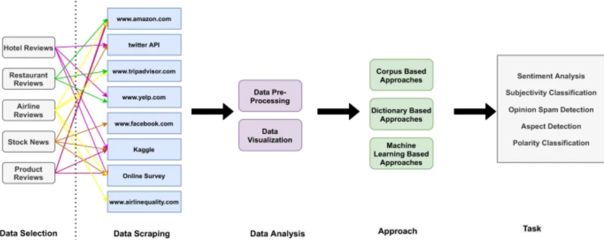

<h1 align="center">
<b>PROYECTO GRUPAL - YELP & GOOGLE MAPS</b>
</h1>

## Indice

  
Tabla de contenidos

  <ol>
    <li><a href="#Introducción">Introducción</a></li>
    <li><a href="#Sobre-Nosotros">Sobre Nosotros</a></li>
    <li><a href="#Equipo-de-Trabajo">Equipo de Trabajo</a></li>
    <li><a href="#Objetivo">Objetivo</a></li>
    <li><a href="#Alcance">Alcance</a></li>
    <li><a href="#Indicadores-Clave---KPIs">KPIs</a></li>
    <li><a href="#Stack-tecnológico">Stack tecnológico</a></li>
    <li><a href="#Pipeline-general">Pipeline general</a></li>
    <li><a href="#ETL-y-EDA">ETL y EDA</a></li>
    <li><a href="#Modelo-Machine-Learning">Modelo ML</a></li>
    <li><a href="#Metodología-de-trabajo">Metodología de trabajo</a></li>
  </ol>

## Introducción

El mercado de atención holística en el estado de Florida, Estados Unidos, ha llamado la atención de **'Active Life Strategies'**, una firma de inversiones en busca de oportunidades estratégicas. Reconociendo la importancia de entender a fondo este sector en evolución, han confiado en los servicios especializados de **'SmartResolve Analytics'**, una firma consultora reconocida por su experiencia en análisis de mercado. En colaboración, se ha llevado a cabo un minucioso estudio del paisaje holístico en los Estados Unidos, utilizando datos de plataformas como Yelp y Google Maps.

El propósito de esta colaboración es proporcionar una perspectiva informada y datos sólidos que respalden las decisiones de inversión. A través de un análisis detallado, no solo se busca minimizar riesgos, sino también identificar oportunidades prometedoras para garantizar el éxito en el dinámico sector de la salud en los Estados Unidos.

## Sobre Nosotros

**SmartResolve Analytics** es una firma consultora que se especializa en el análisis empresarial, destacándose por su enfoque innovador en el uso de la ciencia de datos para impulsar el éxito de las empresas. Nuestro equipo está compuesto por expertos científicos de datos con amplia experiencia en diversos sectores. Nos dedicamos a transformar datos en información valiosa que guía decisiones estratégicas y ofrece una ventaja competitiva en el mercado. Nos distinguimos por nuestra capacidad para ofrecer soluciones personalizadas, adaptadas a las necesidades específicas de cada cliente. Trabajamos en estrecha colaboración con nuestros clientes para comprender sus metas y desafíos, aplicando técnicas avanzadas de análisis de datos para proporcionar información relevante y práctica.

## Equipo de trabajo

- [Alan Sebastián García](https://www.linkedin.com/in/alanseb92/), Data Scientist
- [Ana Paulina Maya Zuluaga](https://www.linkedin.com/in/ana-paulina-maya-zuluaga/), Data Analytics
- [Gala Taddeo Giménez](https://www.linkedin.com/in/galataddeo/), Data Analytics
- [Juan Felipe Rodriguez Granados](https://www.linkedin.com/in/juan-felipe-rodriguez-granados-558673186/), Data Engineer
- [Oscar Gabriel Francovich](https://www.linkedin.com/in/oscargabrielfrancovich/), Data Engineer

## Objetivo

El principal objetivo de esta alianza radica en asegurar una inversión exitosa, fundamentada en un análisis exhaustivo de las percepciones de los clientes en las plataformas Yelp y Google. Específicamente enfocada en el segmento de negocios centrados en el bienestar y la vida saludable en Florida, Estados Unidos, nuestra meta es proporcionar a estos empresarios una evaluación meticulosa del mercado holístico.

El dinámico sector de la salud en Estados Unidos se distingue por su diversidad y vitalidad, reflejando una amplia gama de preferencias y estilos de vida. La colaboración estratégica con SmartResolve Analytics representa una oportunidad única para no solo evaluar la viabilidad financiera, sino también comprender a fondo la compleja interacción de factores sociales, las tendencias emergentes y las preferencias del consumidor en esta región. Con este proyecto nuestro cliente tiene como objetivo principal alcanzar el éxito económico, al mismo tiempo que busca consolidarse como un referente en la prestación de servicios de alta calidad en el ámbito holístico.

## Alcance

El proyecto se centrará en el estado de Florida, Estados Unidos. Es esencial mencionar que éste abarca el comercio de negocios enfocados en el bienestar y mejora de la vida saludable de los clientes.
La elección de centrar el proyecto en el estado de Florida, Estados Unidos, se fundamenta en:
- *La demanda del mercado*: Florida es conocido por tener una población diversa y dinámica, con una gran cantidad de residentes y turistas interesados en estilos de vida saludables y bienestar. Esto crea una demanda sólida y continua para negocios que ofrecen productos y servicios relacionados con la salud y el bienestar.
- *Las tendencias de salud*: Florida se destaca por su clima cálido y su estilo de vida activo al aire libre, lo que fomenta un mayor interés en la salud y el bienestar. Las personas en Florida tienden a estar más conscientes de su salud y a buscar opciones para mejorar su calidad de vida.
- *La infraestructura existente*: Florida ya cuenta con una infraestructura desarrollada para el comercio minorista y de servicios, lo que facilita la entrada y operación de negocios centrados en el bienestar. Además, hay una amplia variedad de recursos y redes disponibles para apoyar el crecimiento de este tipo de negocios.
- *El potencial de crecimiento*: Dado el crecimiento continuo de la población en Florida y su popularidad como destino turístico, existe un gran potencial de crecimiento para los negocios centrados en el bienestar. La demanda sigue creciendo y hay oportunidades para expandir y diversificar la oferta de productos y servicios en este mercado.

## Indicadores Clave - KPIs

* **Tasa de retención de clientes** (objetivo de aumento del 5% en 6 meses) **→** Este KPI mide la capacidad de la empresa para retener clientes durante un período específico (6 meses). La tasa de retención se calcula como el porcentaje de clientes al final del período(después de 6 meses), descontando los nuevos clientes, dividido por el número de clientes al inicio del período. Esto nos proporciona una medida de cómo la empresa ha podido retener a sus clientes existentes y atraer nuevos clientes durante el período. El objetivo es alcanzar un aumento del 5% en la tasa de retención de clientes durante esos 6 meses.

    **→ tasa_retencion =** ((clientes_al_final - nuevos_clientes) / clientes_al_inicio) * 100

* **Promedio de calificación de negocios** (objetivo de aumento de promedio del 3% en 6 meses) **→** Este KPI muestra el promedio de las calificaciones de los negocios durante 6 meses. Se calcula como la suma de las calificaciones de los negocios en el período actual y anterior, dividido por el número total de negocios en el período actual y anterior. El objetivo es alcanzar un aumento del 3% en el promedio de calificación de los negocios durante esos 6 meses.

    **→ promedio_calificacion =** (suma_calificacion_actual + suma_calificacion_anterior) / (numero_total_negocios_actual + numero_total_negocios_anterior)

* **Porcentaje de reseñas positivas** (objetivo de aumento del 10% en 6 meses) **→** Este KPI muestra el porcentaje de reseñas positivas en comparación con el total de reseñas durante 6 meses. Se calcula como el número total de reseñas positivas en el período actual, dividido por el número total de reseñas en el período actual. El objetivo es alcanzar un aumento del 10% en el porcentaje de reseñas positivas durante esos 6 meses.

    **→ porcentaje_reseñas_positivas =** (numero_total_reseñas_positivas / numero_total_reseñas) * 100

* **Tasa de conversión de recomendaciones en visitas** (objetivo de aumento del 10% en 1 año) **→** Este KPI muestra la eficacia de las recomendaciones en generar visitas durante 1 año. Se calcula como el número de visitas en el año actual menos el número de visitas en el año anterior, dividido por el número total de recomendaciones en el año actual y anterior. El objetivo es alcanzar un aumento del 10% en la tasa de conversión de recomendaciones en visitas durante esos periodo de tiempo.

    **→ tasa_conversion_recomendaciones_visitas =** ((visitas_actual - visitas_anterior) / numero_total_recomendaciones) * 100

* **Tasa de crecimiento de la industria** (objetivo de aumento del 10% en 1 año) **→** Este KPI muestra la tasa de crecimiento de la industria durante 12 meses. Se calcula como la diferencia entre el número de negocios en el año actual y el año anterior, dividido por el número de negocios en el año anterior. El objetivo es alcanzar un aumento del 10% en la tasa de crecimiento de la industria durante esos 12 meses.

    **→ tasa_crecimiento_industria =** ((negocios_actual - negocios_anterior) / negocios_anterior) * 100

## Stack tecnológico

* Alojamiento del repositorio y control de versiones con **Github**. Esta plataforma facilita la colaboración entre miembros del equipo, permitiendo la revisión de código, la gestión de problemas y el seguimiento de cambios, asegurando un flujo de trabajo fluido y una integración continua efectiva.

* Control del flujo de tareas y cronograma con **Jira Software**. Es una herramienta de gestión de proyectos ágiles muy utilizada, altamente personalizable y adaptable a las necesidades de cada proyecto.

* Extracción, exploración y transformación de datos con **Python**; es nuestro lenguaje de programación elegido debido a su simplicidad, versatilidad y por ser una herramienta poderosa para el análisis y la manipulación de datos. Usamos **Visual Studio Code** de forma local y **Google Colab** para trabajar de manera colaborativa en línea.

* Herramientas de trabajo en la nube de **Google Cloud Products**. Elegimos trabajar con Google Cloud por ser una plataforma de computación en la nube que comprende una amplia gama de servicios de infraestructura y aplicaciones. Ofrece, de manera integrada, una gran variedad de herramientas para cubrir las diferentes necesidades de nuestro proyecto: almacenamiento, procesamiento y ejecución de código, creación de un Data Warehouse con carga incremental, programación de tareas en la nube, Análisis de Datos, Machine Learning, geolocalización. Existe suficiente documentación de sus herramientas para resolver las dudas sobre su funcionamiento y es una buena opción en términos de costos de operación. Entre las herramientas que utilizamos están:

    - Almacenamiento de datos con **Google Cloud Storage**.
    - Análisis de datos en la nube con **Big Query** y **Google Cloud Functions**
    - Programación y automatización de tareas en la nube con **Google Scheduler**

* Modelos de Machine Learning con Scikit learn y/o Tensorflow.

* Análisis y visualización interactiva de los datos con Looker Studio.

## Pipeline general

## ETL y EDA

### Revisión inicial de calidad de los datos

Tenemos 2 grupos de datos provenientes de Google Maps: Metadata Sitios y Reviews Estados.

**Reviews:**
- Los reviews correspondientes a Florida son 2’850.000 datos, De estos el 62.1%  tienen un comentario en la columna text.
- Text y Rating son los datos más importantes de Reviews.
- Rating maneja una escala de [1-5].
- Ambas tablas pueden conectarse mediante “gmap_id”

**Metadatos**
- La columna category contiene los datos que podemos utilizar para clasificar los negocios.
- En MISC hay datos sobre los servicios adicionales ofrecidos por los negocios.
- Algunas de las palabras claves para nuestro rubro: Health, Organic, Gym, Spa, Vegan, etc
- hay 9.971 valores nulos en category
- Se usarán Longitude y Latitude para localizar geográficamente los negocios.

Tenemos 5 grupos de datos provenientes de Yelp: Businees, Checkin, Review, Tip y User.

**Business**
- Encontramos que hay dos columnas con el mismo nombre, pero las columnas de la 15 en adelante se encuentran casi vacías del todo, por lo que decidimos eliminarlas.
- Tiene un total de 150.346 registros, de los cuales 26.329 corresponden a datos de Florida.
- Contiene principalmente información sobre los negocios: nombre, dirección, latitud, longitud, estado, estrellas, cantidad de reviews, atributos, categorías.
- el campo que sirve para unir esta tabla con las otras es business_id.

**Checkin**
- Contiene únicamente dos columnas:business_id y date. En date encontramos una lista con varias fechas en orden cronológico. Interpretamos que son las fechas en que recibieron clientes en su negocio y usamos este dato para asumir que la fecha del primer checkin nos da información sobre la apertura del negocio.

**Review**
- Contiene 6.990.280. Es necesario hacer un inner join con la tabla ya filtrada de business para extraer los reviews que corresponden a negocios de Florida. Despues de aplicar los filtros de lugar y categorías nos quedan 235.344 rgistros de reviews.
- Sus columnas son review_id, user_id, business_id, date, text y stars.

**Tip**
- Al tener datos muy parecidos a los de Review, pero con menos columnas, decidimos no utilizar esta tabla.

**User**
- Contiene 2.105.597 registros.
- Tiene información sobre los usuarios que dejan reseñas
- Aunque mucha de la información que contiene tal vez no nos sea útil para el análisis de datos creemos que se puede utilizar para alimentar y entrenar el modelo de machine learning que implementaremos.

### Pasos del ETL

- Tratamiento Avanzado de Datos: Realizar un tratamiento exhaustivo a los datos,  enfocado en la estandarización del  formato de los datos (tipos de datos, nombres de las columnas, etc) facilitando así su manipulación y análisis posterior.
- Análisis Estadístico Detallado: Realizar un análisis estadístico detallado con el fin de observar el comportamiento de los dato y su valor. Esto incluye la identificación y tratamiento de valores nulos, duplicados, y outliers.
- Desarrollo de nuevas columnas: Fue necesario unir los valores de latitud y longitud en una sola columna para poder ubicar graficamente los puntos en Looker Studio. Se generó una columna de análsis de sentimiento aplicando un modelo NLTK a la columna text (reviews). De la columna address se extrajeron, en columnas diferentes, la dirección, el estado y la ciudad.

- Filtrado de datos: Se realizó un primer filtro para extraer los registos de negocios, usuarios y reviews ubicados en Florida, USA. Luego de revisar las categorías existentes se elaboró una lista con todas las que coinicían con nuestro segmento. Después, esa gran lista se dividió en cuatro grupos: Terapias, Actividad física, Sitios de comida y Tiendas y productos. Con estos grupos de categorías se filtraron los datasets, para quedarnos únicamente con los registros correspondientes a negocios y reseñas que estuvieran dentro de nuestras categorías en el estado de Florida.

## Diagrama Entidad - Relación (DER)

## Data Warehouse - Flujo de Trabajo

Es momento de subir nuestros datos a Cloud y aplicar sobre ellos los procedimientos de ETL con las herramientas de Google Cloud, para almacenar las tablas con los datos listos y disponibles en un DataWarehouse construido en Big Query.

- El primer paso es capturar los datos que se extraen desde un Drive. Estas son las tablas originales, que vienen en diferentes formatos: .json. ,pkl, .parquet.
- Carga incremental automatizada: Se utiliza la herramienta Google Functions para implementar una función que detecta la llegada de un archivo nuevo a la fuente de datos (Drive), reconoce el patrón y lo carga en una tabla en Data Storage.
- Si no reconoce la estructura del archivo recién llegado, la función puede crear una tabla nueva infiriendo el schema en base a lo que recibe, para almacenar los nuevos datos.
- Se realizan de nuevo, ahora con Google Functions, los procesos de ETL que se habían probado primero de manera local, para dejar listos los datos, disponibles para ser analizados, almacenados en BigQuery.

## Modelo Machine Learning

El Procesamiento Natural del Lenguaje (NLP) es una rama de la inteligencia artificial que permite a las computadoras comprender, interpretar y generar lenguaje humano de manera natural. En el ámbito de la inteligencia de negocios, el NLP se utiliza para realizar análisis de sentimiento en opiniones de clientes, extraer información relevante de grandes cantidades de texto, automatizar respuestas en servicios de atención al cliente y realizar una segmentación de mercado más precisa. Esta tecnología ha transformado la forma en que las empresas utilizan el lenguaje humano para tomar decisiones basadas en datos, mejorar la satisfacción del cliente y optimizar sus operaciones.

## Metodología de trabajo

Para llevar a cabo este proyecto, optaremos por la metodología Scrum, conocida por su alta eficacia en entornos dinámicos y colaborativos. Scrum se caracteriza por su enfoque iterativo e incremental, descomponiendo el proyecto en sprints manejables que culminan con entregables concretos al final de cada iteración. Esta estrategia no solo posibilita la entrega temprana de valor, sino que también simplifica la adaptabilidad a medida que los requisitos van evolucionando.

